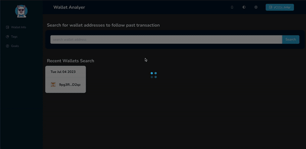

# wallet-analyzer

- I use Shyft APIs to get information about the wallet and analyze their tokens and past transactions.
- Create a Goals and Tags section where users can mint tags to NFTs if they achieve a Goal.

## Why I chose Shyft?
- SHYFT provides a lot of functionalities out of the box, saving your months of me time and cost.

# Techstack
- shyft, vite, reactjs, antd

# Demo

# Live demo
https://grand-jalebi-4a5c7b.netlify.app
